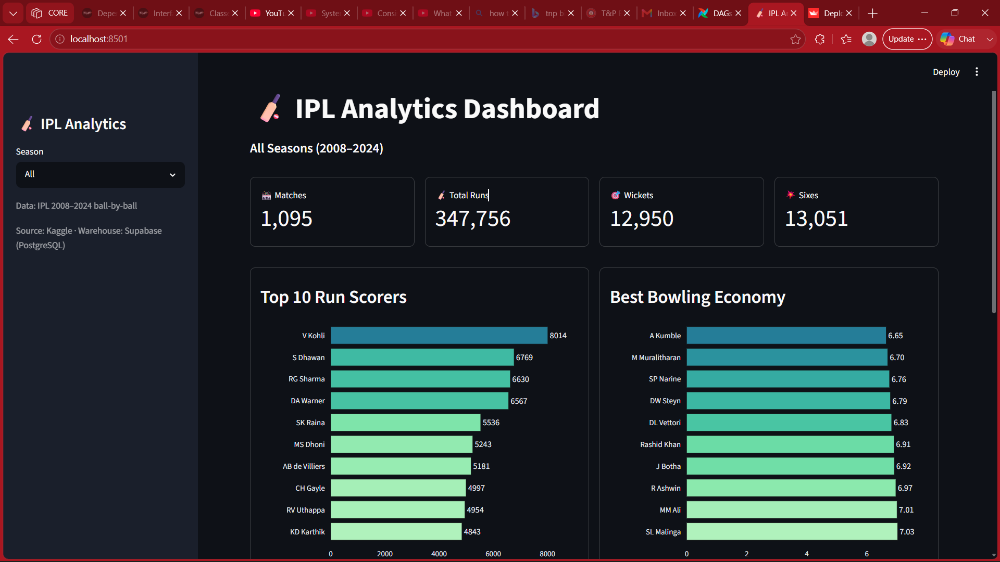
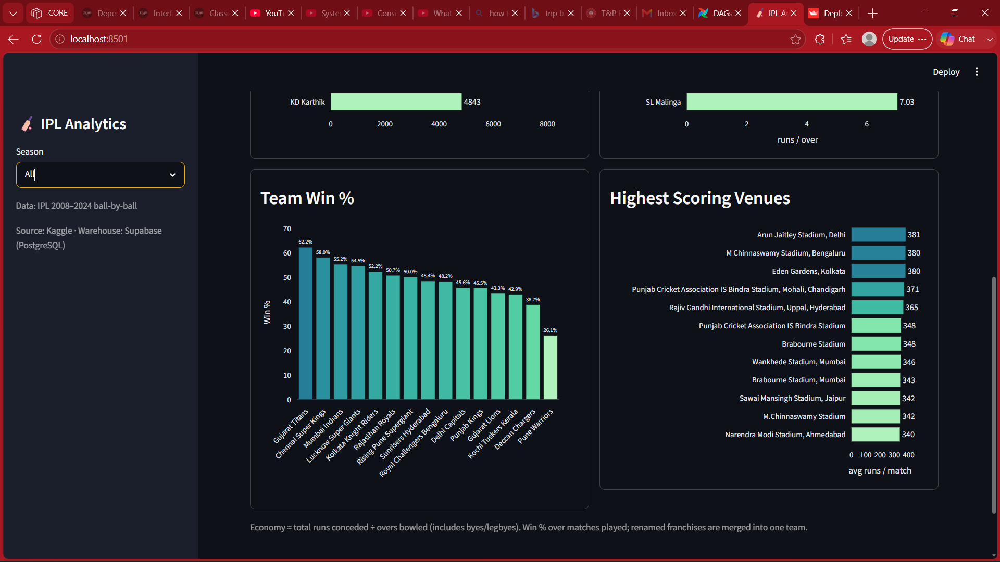
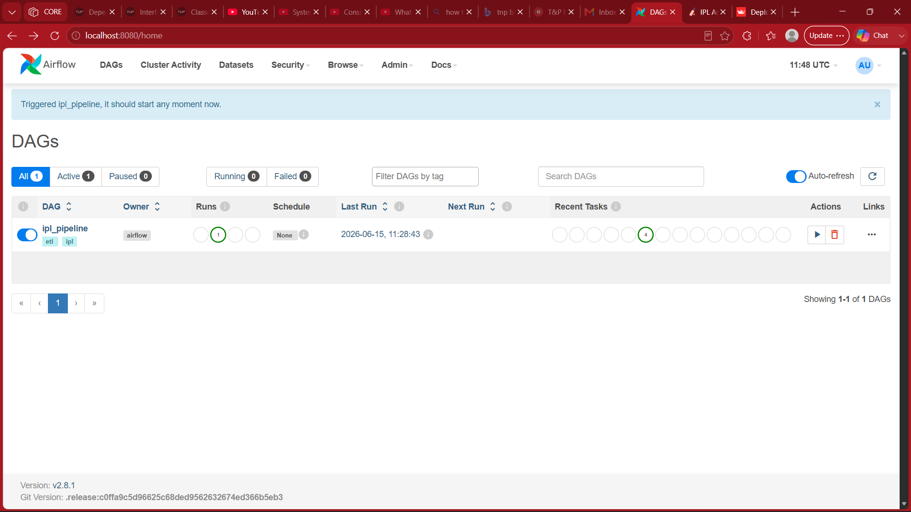
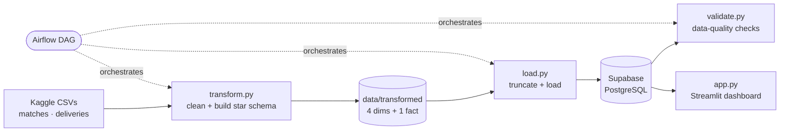

# 🏏 IPL Analytics Pipeline

An end-to-end data engineering project: a daily-orchestrated ETL pipeline that
turns **260,000+ ball-by-ball IPL records** into a star-schema data warehouse
on PostgreSQL, with data-quality checks and an interactive analytics dashboard.

Built with Python, Pandas, SQLAlchemy, **Apache Airflow** (Docker), **Supabase
(PostgreSQL)**, and **Streamlit**.

---

## 📊 Dashboard





Season-filterable KPIs and charts — top run scorers, bowling economy, team win %,
and highest-scoring venues — served from the PostgreSQL warehouse.

## 🛠️ Orchestration (Airflow)



The full ETL runs as a DAG: `check_raw → transform → load → validate`.

---

## Architecture



### Star schema

```
fact_deliveries (260,920 rows)
  match_id → dim_match     inning, over, ball
  batsman_id, bowler_id → dim_player
  batting_team_id, bowling_team_id → dim_team
  runs_scored, extra_runs, total_runs, is_wicket, wicket_type

dim_match (1,095)   season, date, city, teams, toss, winner, venue, result
dim_player (732)    player_name
dim_team (15)       team_name   (renamed franchises merged)
dim_venue (58)      venue_name, city
```

Surrogate keys are assigned deterministically in `transform.py`, which keeps the
load **idempotent** — re-running (or a daily Airflow run) truncates and reloads
to the exact same row counts, never duplicating data.

---

## Tech Stack

| Layer | Technology |
|---|---|
| Language | Python 3.10+ |
| Processing | Pandas, NumPy |
| Database / ORM | PostgreSQL (Supabase), SQLAlchemy, psycopg2 |
| Orchestration | Apache Airflow 2.8 (Docker Compose) |
| Dashboard | Streamlit, Plotly |
| Data Source | Kaggle — IPL 2008–2024 ball-by-ball |

---

## Project Structure

```
ipl-pipeline/
├── transform.py          # clean raw CSVs → star-schema CSVs
├── load.py               # idempotent load into PostgreSQL
├── validate.py           # data-quality / integrity checks
├── queries.py            # parameterized SQL for the dashboard
├── app.py                # Streamlit dashboard
├── schema.sql            # warehouse DDL
├── dags/
│   └── ipl_pipeline.py   # Airflow DAG (check → transform → load → validate)
├── docker-compose.yml    # local Airflow (LocalExecutor)
├── requirements.txt
└── .streamlit/config.toml
```

---

## How to Run

### 1. Setup
```bash
python -m venv venv
venv\Scripts\activate            # Windows  (source venv/bin/activate on macOS/Linux)
pip install -r requirements.txt
```

### 2. Get the data
Download the [IPL ball-by-ball dataset](https://www.kaggle.com/datasets/patrickb314/ipl-ball-by-ball-data)
from Kaggle and place `matches.csv` and `deliveries.csv` in `data/raw/`.

### 3. Configure the database
Create a `.env` file with your Supabase/PostgreSQL connection string:
```
SUPABASE_DB_URL=postgresql://<user>:<password>@<host>:5432/postgres
```
Create the tables by running `schema.sql` in your SQL editor.

### 4. Run the pipeline
```bash
python transform.py      # build star-schema CSVs in data/transformed/
python load.py           # load into PostgreSQL
python validate.py       # confirm data quality
```

### 5. Launch the dashboard
```bash
streamlit run app.py     # http://localhost:8501
```

### 6. (Optional) Orchestrate with Airflow
```bash
docker compose up airflow-init   # one-time
docker compose up                # http://localhost:8080  (airflow / airflow)
```
Unpause and trigger the `ipl_pipeline` DAG.

---

## Data Quality

`validate.py` runs after each load and fails the pipeline if the warehouse is in
a bad state. Checks cover:

- **Completeness** — fact/dimension tables non-empty; all 15 teams and 17 seasons present
- **Referential integrity** — no orphan `match_id` / `batsman_id`, no null foreign keys
- **Validity** — `runs_scored` within the legal 0–7 range per delivery

---

## Notes

- Renamed franchises are merged (e.g. *Delhi Daredevils → Delhi Capitals*,
  *Kings XI Punjab → Punjab Kings*) so a team's full history aggregates correctly.
- Season is derived from each match's date, resolving the dataset's inconsistent
  `2020/21` vs `2021` labels into clean edition years.
- Bowling economy ≈ total runs conceded ÷ overs (includes byes/legbyes).
